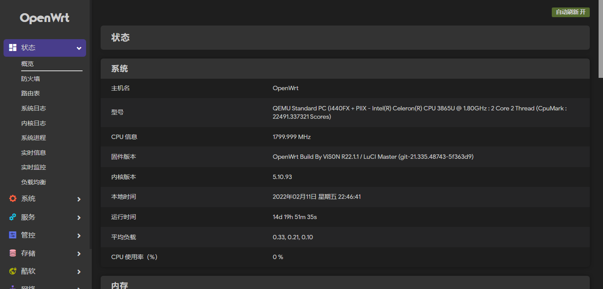
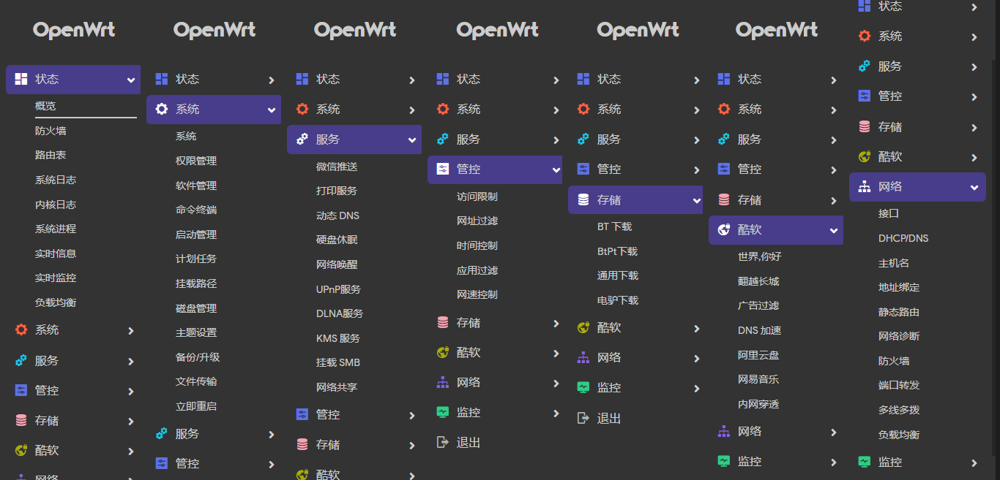

# 编译状态

<!-- version -->

<!-- license -->

## 编译注意

在线Girhub Actions编译Openwrt、Lean和Immortalwrt仓库固件，同步使用上游最新源码！
如需同时编译多个固件，需要两个步骤：
1. 在仓库名字文件夹下放置配置文件夹（可参考AC58U或x86-64文件夹）
2. 同时修改Openwrt-AutoBuild.yml文件的38行
3. 增减插件需自行修改common/common.sh和common/config.diff文件

## 固件信息

1. 固件默认地址：192.168.10.1
2. 固件默认用户：root
3. 固件默认密码：password

## 固件截图

## 参考感谢

1. 固件默认使用Lean为上游源码编译！[Lean仓库地址](https://github.com/coolsnowwolf/lede "https://github.com/coolsnowwolf/lede")
2. 固件选择使用Immortalwrt为上游源码编译！[Immortalwrt仓库地址](https://github.com/immortalwrt/immortalwrt "https://github.com/immortalwrt/immortalwrt")
3. 插件都为网上寻找，插件作者可在Lean/common/common.sh文件中查看，在此表示感谢！
4. 固件主要个人使用，不提供任何技术支持和解答！
