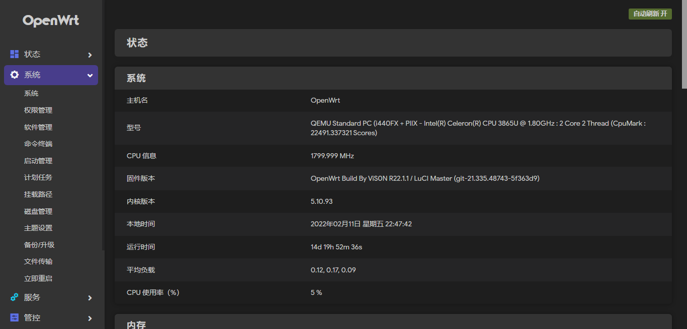
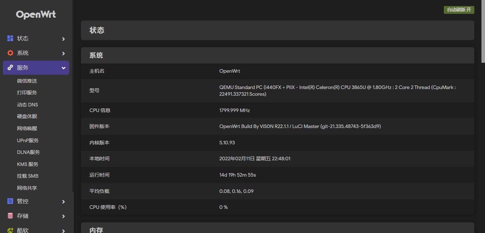
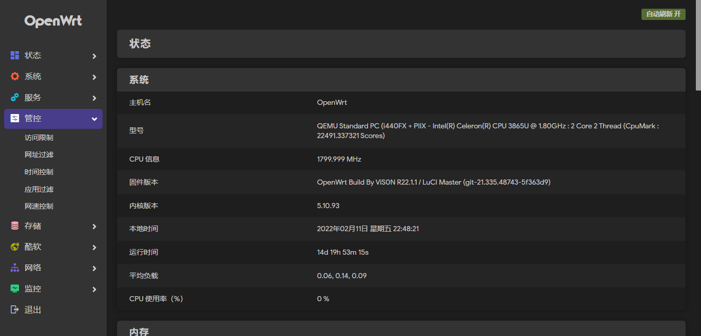
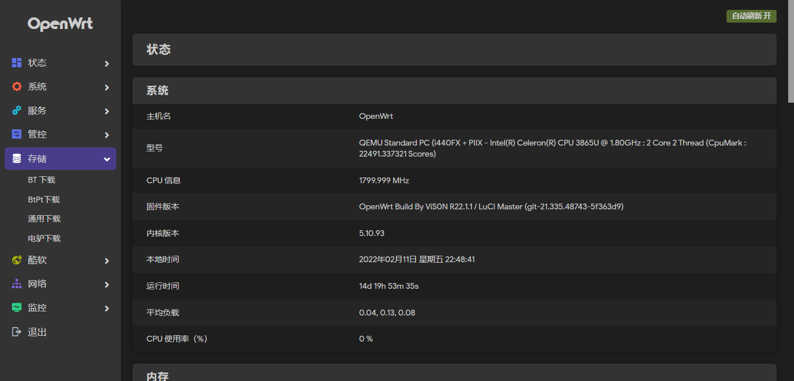
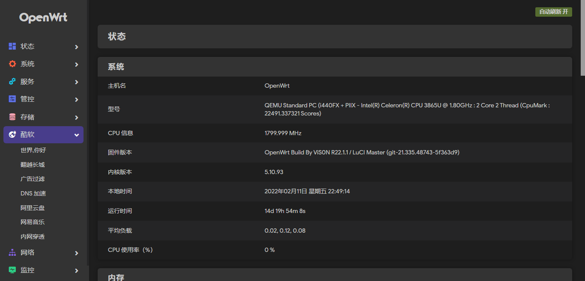
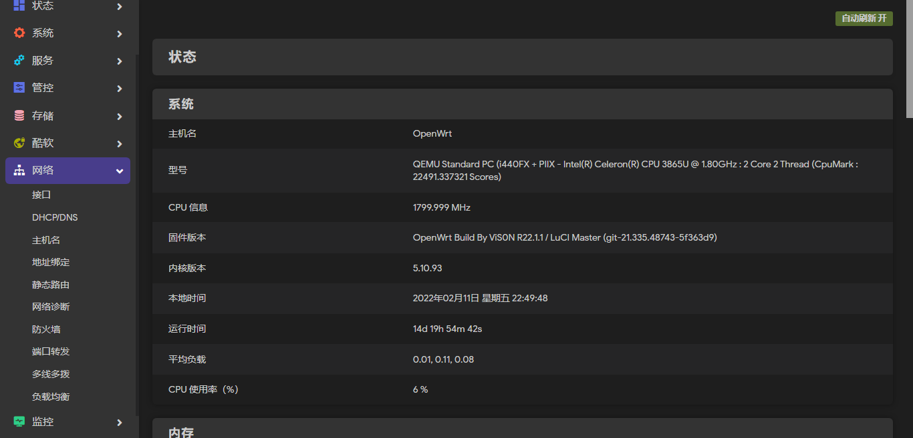
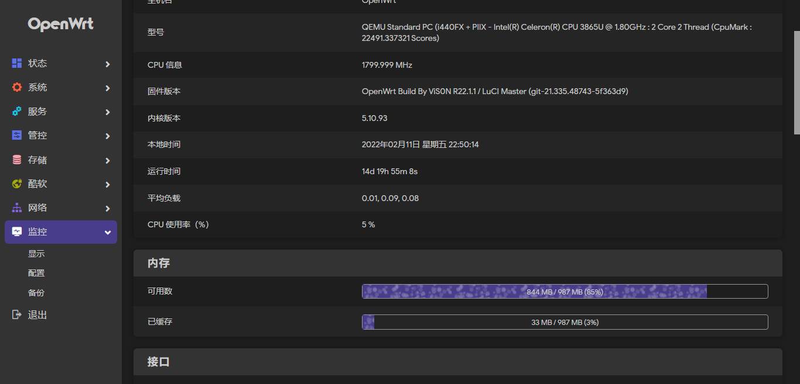

# OpenWrt自动编译


+ 每天自动编译Lean x86-64固件，同步使用上游最新源码！

### 感谢kiddin9，Lean，Lienol:
+ Openwrt-AutoBuild-kiddin9仓库地址：https://github.com/kiddin9/OpenWrt_x86-r2s-r4s
+ Openwrt-AutoBuild-Lean仓库地址：https://github.com/coolsnowwolf/lede
+ Openwrt-AutoBuild-Lienol仓库地址：https://github.com/Lienol/openwrt

## 自动编译
 ```Brach 
    
    
    # 每天自动编译Lean x86-64固件，同步使用上游最新源码！
 ```
 
## 插件截图 








